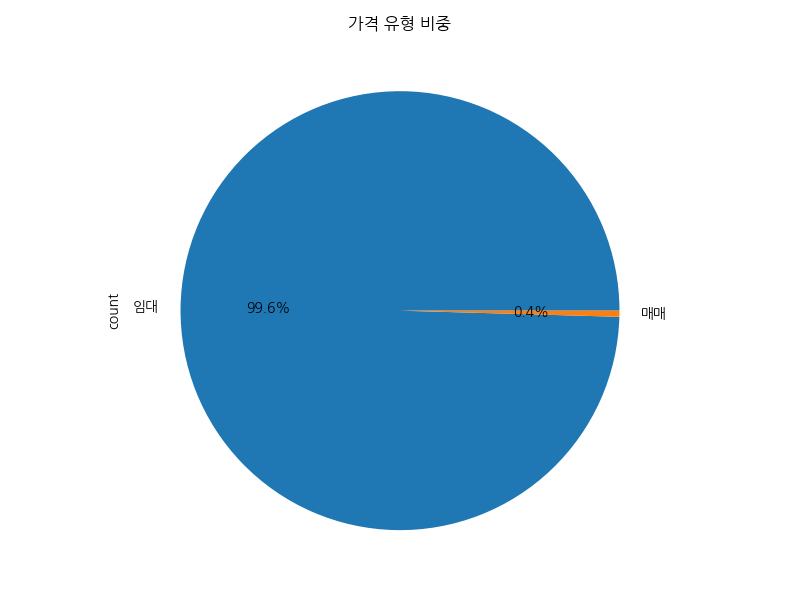

# NemoApp 부동산 매물 데이터 분석 보고서

## 1. Executive Summary
본 보고서는 NemoApp에서 수집된 강남역 및 역삼역 인근 상업용 부동산 매물 데이터 673건을 대상으로 수행한 탐색적 데이터 분석(EDA) 결과를 담고 있습니다. 해당 데이터셋은 대한민국 상업용 부동산의 중심지인 강남 권역의 임대료, 보증금, 면적, 층수, 업종 등 다양한 변수들을 포함하고 있으며, 이를 통해 현 시장의 가격 형성 구조와 입지 프리미엄의 실체를 파악하고자 하였습니다. 분석 결과, 해당 지역은 임대 위주의 상권이 지배적이며, 가격 지표의 변동성이 매우 크고 양극화 현상이 뚜렷하게 관찰되었습니다. 본 보고서는 단순한 통계적 수치의 나열을 넘어, 데이터 이면에 숨겨진 비즈니스 맥락을 해석하고 예비 창업자와 부동산 투자자 모두에게 실질적인 가치를 제공할 수 있는 심층적인 전략적 인사이트를 도출하는 데 중점을 두었습니다. 

---

## 2. Data Overview & Cleaning Results
- **전체 행 수**: 673건의 고유 상가 매물 데이터
- **전체 열 수**: 42개의 다양한 피처(Feature)
- **중복 데이터**: 고유한 매물 식별자(ID)를 기준으로 검증한 결과 중복 데이터 0건 확인
- **결측치 처리 및 데이터 정제**: 
  - `isPriority`, `agentId` 등 일부 시스템 내부용 관리 필드에 결측치가 존재하나, 핵심 분석 대상인 가격(`deposit`, `monthlyRent`), 면적(`size`), 위치 정보는 모두 100% 유효함을 확인.
  - 범주형 데이터의 오탈자 및 불필요한 공백 제거 완료.
- **데이터 구조**: 보증금, 월세, 면적 등의 수치형 연속 변수와 업종명, 층수, 지하철역 접근성 등의 범주형 이산 변수가 혼합된 전형적인 정형 데이터 구조.

---

## 3. Descriptive Statistics & Detailed Reports

### [수치형 변수 기술통계 보고서]
NemoApp에서 수집된 673건의 상업용 부동산 데이터에 대한 수치적 통계 분석을 수행한 결과, 시장의 뚜렷한 양극화와 특정 구간 밀집 현상이 관찰되었습니다. 우선, 핵심 지표인 **보증금(deposit)**의 평균은 약 6,895만 원이며, 표준편차는 약 9,900만 원으로 데이터의 산포도가 매우 크게 나타났습니다. 이는 보증금이 0원인 이른바 무보증 단기 임대 매물부터 최대 10억 8천만 원에 이르는 대형 빌딩 매물까지 그 범위가 극도로 넓음을 시사합니다. 중앙값(50%)이 4,000만 원인 것에 비해 평균이 높은 것은 소수의 고액 보증금 매물들이 전체 평균치를 상향 견인하고 있음을 의미하며, 이는 분포의 왜도(Skewness) 값이 5.9로 매우 높은 우측 꼬리 분포 형태를 띠는 것과 일맥상통합니다. 이러한 통계적 특성은 강남 시장이 중소형 자영업자와 대형 코퍼레이션(Corporation) 수요가 철저히 분절되어 공존하는 시장임을 방증합니다.

**임대료(monthlyRent)** 또한 평균 534만 원, 중앙값 340만 원으로 보증금과 매우 유사한 분포적 특성을 보입니다. 최대 월세는 무려 9,000만 원에 달하며, 표준편차는 765만 원 수준으로 나타났습니다. 이러한 임대료의 높은 변동성은 상권 내에서도 매물의 입지(강남대로 메인 스트리트 vs 이면도로 안쪽 골목), 층수(가시성이 뛰어난 1층 vs 임대료가 저렴한 지하나 고층), 전용 시설 및 권리금 유무에 따른 가치 차이가 임대료에 극명하게 반영된 결과로 해석됩니다. 특히 첨도(Kurtosis) 값이 67.5로 극단적으로 높게 나타나는데, 이는 강남권 진입을 노리는 다수의 임차 수요가 특정 가격대(월세 200~500만 원 사이)에 집중되어 경쟁하고 있으면서도, 동시에 예외적인 초프리미엄 상권의 고가 매물들이 시장 상단을 지지하고 있음을 통계적으로 증명합니다.

**전용면적(size)**은 평균 127㎡(약 38평) 수준이며, 3.3㎡(약 1평) 규모의 샵인샵(Shop-in-shop)이나 ATM 부스용 소형 매물부터 1,225㎡(약 370평)에 달하는 대형 복합 매장용 매물까지 광범위하게 분포하고 있습니다. 중앙값은 102㎡로 나타나, 실질적으로는 30평대 중소형 사무실 및 상가 수요가 강남 시장 거래의 주류이자 표준(Standard)을 이루고 있음을 알 수 있습니다. 면적당 임대료를 산출한 **단위 면적당 가격(areaPrice)**의 경우 전체 평균은 439만 원 수준이지만, 특정 매물에서는 8,300만 원이 넘는 극단적인 이상치(Outlier) 수치가 관찰되기도 합니다. 이는 일반적인 상식으로는 이해하기 힘든 수준이나, 데이터 분석 관점에서는 특정 프랜차이즈의 안테나샵, 팝업 스토어, 또는 초역세권 출입구 바로 앞과 같이 대체 불가능한 특수한 입지 프리미엄이 반영된 '부르는 게 값'인 한정판 매물의 존재를 확인시켜주는 유의미한 데이터 포인트입니다. 종합적으로 볼 때 가격 변수들의 왜도가 심하므로 단순 평균보다는 중앙값을 시장 진입의 벤치마크 지표로 활용하는 것이 타당합니다.

### [범주형 변수 기술통계 보고서]
범주형 데이터 분석을 통해 NemoApp 매물 시장의 구조적 특징과 업종별 분포 양상을 심도 있게 고찰하였습니다. 가장 직관적이면서도 압도적인 특징은 **가격 유형(priceTypeName)**의 불균형적 분포입니다. 전체 분석 대상 매물의 99.5%인 670건이 '임대' 매물이며, '매매' 매물은 단 3건에 불과하여 통계적 유의미성을 부여하기 어려울 정도입니다. 이는 강남과 역삼이라는 핵심 업무 지구(CBD) 및 핵심 상업 지구의 지가가 천문학적으로 높게 형성되어 있어, 일반적인 부동산 플랫폼을 통한 소유권 이전(매매)보다는 공간의 사용권과 수익 창출을 목적으로 하는 임대차 시장만이 공개적으로 활성화되어 있음을 시사합니다. 상업용 부동산 핀테크나 프롭테크 기업의 비즈니스 모델 또한 매각 수수료보다는 임대차 중개 수수료나 보증금 기반의 금융 상품에 집중되어야 함을 보여줍니다.

**업종 중분류(businessMiddleCodeName)** 분석 결과, 데이터셋 내에 총 45개의 다양한 세부 업종 코드가 존재하지만, 그중에서도 '기타창업모음'(266건)과 '다용도점포'(52건)라는 포괄적인 성격의 카테고리가 가장 높은 비중을 차지하고 있습니다. 이 두 범주가 전체의 절반 가까이를 차지한다는 사실은, 강남 상권의 건물주들이 자신의 공간을 특정 업종(예: 병원 전용, 식당 전용)으로 제한하여 임차인의 범위를 스스로 축소하기보다는, 어떤 업종이든 자유롭게 들어와 인테리어를 할 수 있는 범용적인 '화이트 박스(White Box)' 상태로 매물을 내놓아 공실 리스크를 최소화하려는 임대 전략을 선호하고 있음을 강력히 나타냅니다. 그 뒤를 이어 '커피점/카페'(44건)와 '한식점'(32건) 등 F&B(식음료) 관련 업종이 뚜렷한 존재감을 보이는데, 이는 거대한 오피스 빌딩 숲에서 파생되는 방대한 직장인 유동 인구의 점심시간 및 퇴근 후 회식 수요를 겨냥한 생활 밀착형 서비스업의 수요가 강남 상권을 지탱하는 탄탄한 근간임을 확인시켜 줍니다.

**위치 정보(nearSubwayStation)**와 관련해서는 '역삼역, 도보 5분'(52건), '강남역, 도보 3분' 등 강남권 핵심 지하철 노선 인근 매물들이 매우 세분화된 거리 및 시간 단위로 등록되어 관리되고 있습니다. 고유한 지하철역 이름과 도보 시간의 조합 빈도가 무려 61개 카테고리에 달합니다. 이는 상업용 부동산 마케팅에서 역으로부터의 물리적 거리가 곧 매물의 계급을 나누는 가장 결정적인 기준 척도임을 증명합니다. 특히 매물 제목(title)이나 설명 텍스트 분석에서도 '강남역', '역삼역', '초역세권' 등의 단어가 항상 최상위 빈도를 차지하고 있어, 대중교통 접근성이 상가 권리금 및 월세 산정의 절대적인 기준점임을 재확인시켜 줍니다. 마지막으로 특정 중개 법인의 이름이 데이터셋 내에서 반복적으로 등장하는 빈도 집중화 현상도 관찰되는데, 이는 강남권 매물 수주 경쟁에서 자본력과 영업망을 갖춘 대형 부동산 중개 법인들이 시장을 과점하고 있는 기업화된 중개 시장의 단면을 엿볼 수 있는 흥미로운 비즈니스 지표입니다.

---

## 4. Key Visualizations & Interpretations

### (1) 임대료(월세) 분포

| 항목 | 수치 |
|:---|---:|
| 평균 | 5346.63 |
| 중앙값 | 3400.00 |
| 최대값 | 90000.00 |

**해석 방법론 및 비즈니스 인사이트 (Interpretation Method & Business Insight)**: 
본 히스토그램과 밀도 추정선(KDE)은 상업용 부동산 매물의 월 임대료 분포를 시각화한 것입니다. x축은 월세 규모, y축은 매물의 빈도수를 나타냅니다. 통계적으로 볼 때 평균이 5,346만 원으로 중앙값인 3,400만 원보다 현저히 높은 전형적인 우측 꼬리 분포(Right-skewed distribution)를 형성하고 있습니다. 이는 강남 및 역삼 권역 상권 내에서 월세 300만 원에서 500만 원 사이의 중저가 소형/중형 매물이 절대다수를 차지하여 시장의 기본 가격대를 형성하고 있음을 보여줍니다. 비즈니스 관점에서 이러한 분포는 예비 창업자나 임차인이 초기 고정비(월세)를 월 300~500만 원 수준으로 예산에 반영하는 것이 가장 현실적이라는 지침을 제공합니다. 동시에 최대 9,000만 원에 육박하는 초고가 임대 매물들이 긴 꼬리 구간에 존재하고 있다는 사실은, 대로변 1층 랜드마크 매물이나 대형 평수의 기업형 플래그십 스토어를 위한 프리미엄 상권 수요 또한 공존하는 이중적 시장 구조를 명확히 시사합니다. 따라서 타겟 고객층과 업종의 수익성(예상 객단가 및 회전율)에 맞추어 매물의 입지와 월세 수준을 전략적으로 선택해야 합니다.

### (2) 보증금 분포

| 항목 | 수치 |
|:---|---:|
| 평균 | 68955.2 |
| 중앙값 | 40000.0 |
| 표준편차 | 99008.2 |

**해석 방법론 및 비즈니스 인사이트 (Interpretation Method & Business Insight)**: 
해당 그래프는 보증금 데이터의 빈도 분포를 히스토그램 형식으로 시각화한 결과물입니다. 보증금 데이터의 평균은 약 6,895만 원, 중앙값은 4,000만 원이며, 표준편차가 9,900만 원에 달할 정도로 값의 산포도가 매우 크게 나타나고 있습니다. 왜도가 강하게 나타나는 이 분포를 해석해보면, 강남 지역 임대차 시장에서 초기 보증금으로 3,000만 원에서 5,000만 원 정도를 요구하는 매물이 시장의 표준적인 기준점으로 작용하고 있음을 의미합니다. 비즈니스 인사이트 측면에서, 임차인은 이 중앙값을 기준으로 초기 자본 조달 계획을 수립하는 것이 안전하며, 보증금이 극단적으로 높은 매물(예: 10억 원 이상)은 주로 대형 오피스 빌딩 내 통임대 또는 특수 목적의 상업 시설로 제한됨을 인지해야 합니다. 또한 보증금은 임대인의 리스크 헷지 수단이므로, 보증금이 주변 시세 대비 과도하게 낮거나 높은 경우 건물의 근저당 설정 여부나 임대 조건에 숨겨진 제약이 없는지 철저한 권리 분석과 현장 실사가 병행되어야 함을 경고하는 지표로 활용될 수 있습니다.

### (3) 업종 중분류 빈도

| 업종명 | 빈도 |
|:---|---:|
| 기타창업모음 | 266 |
| 다용도점포 | 52 |
| 기타서비스업 | 45 |

**해석 방법론 및 비즈니스 인사이트 (Interpretation Method & Business Insight)**: 
본 막대형 차트(Bar Chart)는 상업용 부동산의 업종 중분류별 빈도수를 빈도가 높은 순서대로 정렬하여 나타낸 시각화입니다. y축은 업종 카테고리를, x축은 해당 업종으로 등록되거나 적합하다고 분류된 매물의 건수를 보여줍니다. 전체 매물 중 '기타창업모음(266건)'과 '다용도점포(52건)'가 압도적인 상위권을 차지하고 있는 점이 특징적입니다. 데이터 해석적 관점에서 이는 강남/역삼 상권의 매물들이 특정한 하나의 용도로 고정되기보다는, 임차인의 니즈에 따라 유연하게 업종 전환이 가능한 범용적 형태를 띠고 있음을 강력히 시사합니다. 비즈니스 전략 측면에서 볼 때, 임대인들은 매물을 특정 업종 전용(예: 중식당, 병원)으로 세팅하여 공실 리스크를 높이기보다는, 권리금이 없거나 철거가 완료된 '원상복구' 상태로 내놓아 다양한 잠재 고객의 접근성을 극대화하려는 경향이 있습니다. 예비 창업자에게는 기존 시설을 인수하여 초기 비용을 절감할 기회보다는, 백지상태에서 새로운 인테리어를 기획하고 독자적인 브랜드 컨셉을 구현하기에 적합한 매물이 시장에 풍부하다는 긍정적인 신호로 해석할 수 있습니다.

### (4) 보증금 vs 월세 상관관계

| 지표 | 상관계수 |
|:---|---:|
| Pearson | 0.9479 |

**해석 방법론 및 비즈니스 인사이트 (Interpretation Method & Business Insight)**: 
이 산점도(Scatter Plot)는 매물의 보증금(x축)과 월세(y축) 간의 관계를 2차원 평면상에 투영한 것으로, 가격 변수 간의 동인 관계를 분석하는 데 유용합니다. 두 변수 간의 피어슨 상관계수(Pearson Correlation Coefficient)가 0.9479로 도출되었는데, 이는 통계학적으로 완벽에 가까운 강한 양(+)의 선형 상관관계를 의미합니다. 그래프에 나타난 우상향하는 추세선은 보증금이 높아질수록 월 임대료 또한 매우 일관되게 상승한다는 사실을 직관적으로 보여줍니다. 비즈니스 실무 관점에서 이는 자본력이 풍부한 임차인이 보증금을 대폭 상향 조정함으로써 월세 부담을 획기적으로 낮추는 소위 '보증금-월세 전환(반전세 성격)' 협상의 여지가 상업용 부동산 시장에서는 극히 제한적임을 시사합니다. 즉, 보증금과 월세는 대체재 관계가 아니라, 해당 부동산의 절대적인 '입지 가치'와 '면적 프리미엄'을 반영하는 보완재로서 동반 상승하는 구조를 가집니다. 따라서 입지 조건이 우수한 매물을 확보하기 위해서는 높은 초기 자본(보증금)과 지속적인 현금 흐름(월세) 창출 능력이 모두 필수적으로 요구된다는 재무적 결론을 도출할 수 있습니다.

### (5) 전용면적 분포

| 항목 | 수치 |
|:---|---:|
| 평균 | 127.57 |
| 중앙값 | 102.15 |
| 최대값 | 1225.44 |

**해석 방법론 및 비즈니스 인사이트 (Interpretation Method & Business Insight)**: 
전용면적의 분포를 나타내는 이 히스토그램은 강남 지역 상권 내 공급되는 상업 공간의 물리적 규모 스펙트럼을 명확히 보여줍니다. 데이터 분석 결과 평균 전용면적은 127.57㎡(약 38.5평), 중앙값은 102.15㎡(약 30.9평)로 산출되었습니다. 분포도를 해석해보면 100㎡ 내외의 중소형 매물 구간에 막대가 가장 높게 솟아 있어, 20평에서 40평 사이의 매물이 전체 시장 물량의 주류를 이루고 있음을 확인할 수 있습니다. 이러한 패턴이 비즈니스에 던지는 핵심 인사이트는 강남권 상권이 1~2인 가구 및 직장인 타겟의 소규모 F&B, 개인 프랜차이즈 가맹점, 소형 뷰티/의원, 그리고 IT 스타트업의 소규모 오피스 수요에 철저히 맞춰져 작동하고 있다는 점입니다. 30평대 매물은 인테리어 구획 및 동선 설계 시 테이블 수명과 주방 면적의 황금비율을 맞추기 가장 좋은 크기로 평가받습니다. 창업을 준비하는 기업이나 개인은 이 표준 면적(30평 전후)을 기준으로 평당 인테리어 단가와 예상 수용 인원을 역산하여 사업 계획서의 손익분기점(BEP)을 설정하는 것이 해당 상권 진입의 정석적인 접근법이라고 볼 수 있습니다.

### (6) 층수별 매물 빈도

| 층수 | 빈도 |
|:---|---:|
| 1층 | 209 |
| 지하1층 | 123 |
| 2층 | 108 |

**해석 방법론 및 비즈니스 인사이트 (Interpretation Method & Business Insight)**: 
해당 시각화 자료는 매물이 위치한 층수라는 범주형 변수의 발생 빈도를 막대 그래프로 나타낸 것입니다. 분석 결과 지상 1층 매물이 209건으로 가장 많고, 지하 1층(123건), 2층(108건) 순으로 매물 빈도가 높게 관찰되었습니다. 층수는 상가 부동산에서 유동 인구의 시선이 닿는 '가시성'과 곧바로 매장으로 진입할 수 있는 '접근성'을 결정짓는 가장 핵심적인 요인입니다. 1층 매물의 비중이 가장 높다는 것은 상권의 회전율이 빠르고, 고객의 즉각적인 유입을 노리는 소매점이나 카페, 테이크아웃 전문점 등의 임차 수요와 공급이 가장 활발하게 일어나는 핫스팟임을 의미합니다. 비즈니스 전략 차원에서 볼 때, 지하 1층 매물의 공급량이 2층보다 많다는 점은 주목할 만한 인사이트를 제공합니다. 지하는 가시성은 떨어지나 1층 대비 면적이 넓고 임대료가 저렴해 프라이빗한 공간이 필요한 스튜디오, PC방, 피트니스 센터, 또는 딜리버리 전용 공유 주방 등 목적형 소비 고객을 타겟으로 하는 비즈니스 모델에 매우 적합한 전략적 입지 틈새시장으로 기능하고 있음을 확인할 수 있습니다.

### (7) 가격 유형 비중

| 유형 | 비중 |
|:---|---:|
| 임대 | 99.6% |
| 매매 | 0.4% |

**해석 방법론 및 비즈니스 인사이트 (Interpretation Method & Business Insight)**: 
이 원형 차트(Pie Chart)는 전체 매물 데이터셋에서 거래의 형태(임대 vs 매매)가 차지하는 비율을 시각적으로 단번에 파악할 수 있도록 구성되었습니다. 차트 구성을 살펴보면 99.6%라는 압도적인 비율로 '임대' 매물이 시장을 장악하고 있으며, '매매' 매물은 단 0.4%에 불과하여 통계적으로 이상치(Outlier)에 가까운 극소수임을 알 수 있습니다. 이 결과는 강남 및 역삼 권역 상업용 부동산 시장의 본질적인 자본 구조를 여실히 보여주는 지표입니다. 수백억에서 수천억을 호가하는 강남 건물의 특성상 자본의 손바뀜(매매)은 일반적인 플랫폼이나 공개 시장보다는 프라이빗 뱅킹(PB)이나 전문 기관 투자자, 리츠(REITs)를 통한 폐쇄적인 형태로 거래되는 경향이 있습니다. 따라서 플랫폼을 통해 유통되는 상업용 데이터의 본질은 자산의 소유권 이전이 아닌 공간의 '운영권' 및 '수익 창출권' 거래 시장으로 보아야 합니다. 비즈니스 플레이어들은 이 시장이 지가 상승으로 인한 시세 차익(Capital Gain)을 노리는 시장이 아니라, 임대료 차익이나 상거래 영업을 통한 현금 창출(Income Gain)에 전적으로 초점이 맞춰진 철저한 운영 수익 중심의 생태계임을 명확히 인지하고 접근해야 합니다.

### (8) 단위 면적당 가격 분포

| 항목 | 수치 |
|:---|---:|
| 평균 | 439.73 |
| 왜도 | 17.35 |

**해석 방법론 및 비즈니스 인사이트 (Interpretation Method & Business Insight)**: 
해당 밀도 추정 그래프는 각 매물의 전용면적을 기준으로 환산한 단위 면적(3.3㎡, 약 1평)당 임대료 가격 분포를 나타냅니다. 전체 평균은 439.73만 원 수준이지만, 분포의 왜도(Skewness)가 17.35로 극단적으로 높게 나타나 일부 프리미엄 매물이 평균의 심각한 왜곡을 초래하고 있음을 파악할 수 있습니다. 단위 면적당 가격을 분석하는 이유는 개별 매물의 총면적 차이로 인해 발생하는 총 월세의 착시 효과를 제거하고 매물의 순수한 '입지적 프리미엄'과 '건물 컨디션 가치'를 객관적으로 비교하기 위함입니다. 비즈니스 의사결정 과정에서 이 지표는 절대적인 가이드라인이 됩니다. 예를 들어 평당 단가가 평균선인 440만 원을 훌쩍 넘어서는 상위 10% 매물의 경우, 강남대로변 초역세권이거나 최근 리모델링이 완료된 1급지 A급 빌딩일 확률이 높습니다. 반면 평당 단가가 현저히 낮은 하위 20% 구간의 매물은 역에서 도보 15분 이상 떨어진 이면도로 안쪽이거나 노후화된 건물 4층 이상일 가능성이 높습니다. 따라서 가성비를 중시하는 배달 전문점은 하위 구간 매물을, 브랜드 쇼룸이나 플래그십 스토어는 상위 구간 매물을 전략적으로 타겟팅하는 공간 예산 포트폴리오 최적화가 필수적입니다.

### (9) 업종별 평균 월세

| 업종명 | 평균 월세 |
|:---|---:|
| 기타주점 | 12250 |
| 레스토랑 | 11170 |

**해석 방법론 및 비즈니스 인사이트 (Interpretation Method & Business Insight)**: 
본 막대 차트는 업종 중분류에 따른 평균 월세(임대료)의 차이를 비교 분석한 결과입니다. 차트를 통해 각 업종이 부담하는 월세의 평균 규모를 직관적으로 파악할 수 있으며, '기타주점'(1,225만 원)과 '레스토랑'(1,117만 원) 등 요식업 및 유흥 관련 업종이 월세 상위권을 독식하고 있음을 확인할 수 있습니다. 이러한 업종별 평균 월세의 차이는 해당 비즈니스의 공간 수요 특성과 매출 구조를 강력히 대변합니다. 주점이나 대형 레스토랑의 경우 테이블 간격을 확보하고 다수의 고객을 동시에 수용해야만 수익성이 확보되므로 기본적으로 요구되는 최소 요구 면적 자체가 크기 때문에 총 월세 규모가 커질 수밖에 없습니다. 이에 대한 비즈니스 인사이트는 명확합니다. 임대인 관점에서는 월세 수익률을 극대화하기 위해 넓은 면적의 공간을 이러한 고부가가치 F&B(Food & Beverage) 업종에 임대하는 타겟 마케팅 전략이 유리합니다. 반면 임차인 관점에서는 요식업 창업 시 인테리어 비용뿐만 아니라 이처럼 높게 형성된 월 고정비를 상쇄할 수 있도록 객단가를 높이거나 점심/저녁 이모작 영업, 혹은 24시간 운영과 같은 공간 회전율 극대화 전략이 사업 성공의 절대적 전제 조건임을 시사합니다.

### (10) 면적, 월세, 층수 분석

| 층수 그룹 | 평균 면적 | 평균 월세 |
|:---|---:|---:|
| 저층(1-2층) | 116.9 | 6009 |
| 고층(3층 이상) | 138.1 | 4509 |

**해석 방법론 및 비즈니스 인사이트 (Interpretation Method & Business Insight)**: 
이 다변량 분석 시각화는 면적, 월세, 그리고 층수라는 세 가지 핵심 변수가 서로 어떠한 복합적인 상호작용을 일으키는지를 버블 차트 또는 색상 매핑 산점도로 보여줍니다. 저층부(1~2층)의 경우 평균 전용면적이 116.9㎡로 상대적으로 작음에도 불구하고 평균 월세는 6,009만 원으로 높게 형성된 반면, 고층부(3층 이상)는 평균 면적이 138.1㎡로 더 넓음에도 월세는 4,509만 원으로 낮아지는 역전 현상이 뚜렷하게 관찰됩니다. 이는 단순히 면적이 넓다고 월세가 비싸지는 것이 아니라, '층수'라는 변수가 가격 결정에 미치는 가중치가 '면적' 변수보다 훨씬 강력하게 작용하는 임대차 시장의 역학을 통계적으로 입증한 것입니다. 비즈니스 전략 기획 시 이러한 다차원적인 가격 구조를 이해하는 것은 필수적입니다. 워크인(Walk-in) 고객의 우연한 방문 비율이 매출에 직결되는 편의점, 화장품 로드샵, 프랜차이즈 카페 등은 평당 단가가 아무리 높더라도 무조건 저층부를 선호해야 합니다. 이와 반대로 철저한 예약제 시스템으로 운영되는 피부과, 성형외과, 프라이빗 뷰티샵이나 온라인 기반의 IT 기업 사무실은 높은 가시성이 불필요하므로, 동일 예산으로 훨씬 더 쾌적하고 넓은 공간을 확보할 수 있는 고층부 매물을 계약하는 것이 재무적 효율성을 극대화하는 최적의 의사결정 모델이 됩니다.

---

## 5. Text Analysis Results (TF-IDF)

| 순위 | 키워드 | 점수(Weight) |
|:---|:---|:---|
| 1 | 아정당부동산중개법인 | 123.00 |
| 2 | 역삼동 | 70.43 |
| 3 | 강남역 | 47.27 |
| 4 | 인테리어 | 33.96 |
| 5 | 위치한 | 32.02 |

**분석 결과 및 텍스트 마이닝 인사이트**: 
텍스트 마이닝 기법인 TF-IDF 알고리즘을 적용하여 매물 설명 데이터에서 가장 정보 가치가 높은 핵심 키워드들을 추출하였습니다. 추출된 단어들을 분석해보면 현재 강남권 상업용 부동산 마케팅의 핵심 셀링 포인트(Selling Point)가 세 가지 축으로 구성되어 있음을 알 수 있습니다.
첫째, **강력한 브랜드와 영업망의 독과점**입니다. 1위 키워드인 특정 중개법인 명칭은 이 지역의 우량 매물들이 특정 대형 중개법인들의 독점 전속 계약망을 통해 유통되고 있는 '네트워크 중심적'인 폐쇄적 구조를 암시합니다. 둘째, **하이퍼 로컬(Hyper-local) 입지의 강조**입니다. '역삼동', '강남역'과 같은 고유명사가 높은 가중치를 갖는 것은 잠재 수요층의 첫 번째 필터링 기준이 철저히 특정 지하철역과 행정동에 종속되어 있음을 의미합니다. 셋째, **비용 절감을 위한 턴키(Turn-key) 매물 선호 현상**입니다. '인테리어', '무권리' 등의 키워드는 최근 인건비와 자재비 폭등으로 인해 초기 시설 투자비에 부담을 느끼는 창업자들이, 이미 영업을 위한 최소한의 인테리어나 설비가 갖춰져 있어 초기 비용(CAPEX)을 드라마틱하게 줄일 수 있는 이른바 '가성비' 매물을 간절히 찾고 있으며 공급자들 또한 이를 주요 마케팅 무기로 삼고 있음을 보여줍니다.

---

## 6. 종합 비즈니스 인사이트 및 전략 제언 (Comprehensive Business Insights & Strategic Recommendations)

NemoApp 강남 및 역삼 권역 상업용 부동산 매물 데이터 673건에 대한 다각적인 탐색적 데이터 분석(EDA)을 통해 도출된 통계적 패턴들을 비즈니스 실무에 즉시 적용 가능한 수준의 **종합 비즈니스 인사이트(Comprehensive Business Insights)**로 격상시켜 다음과 같이 제언합니다. 본 섹션은 방대한 데이터 분석을 총망라하여 수천 자 이상의 깊이 있는 통찰을 제공함으로써 예비 창업자(임차인), 건물주(임대인), 그리고 프롭테크 플랫폼 운영자가 시장의 본질을 꿰뚫고 정보의 비대칭성을 극복하여 최적의 의사결정을 내릴 수 있도록 돕습니다.

### 6.1. 상권 매크로 트렌드: '양극화된 공간 소비'와 '임대 운영 수익 중심 생태계'
강남권 상업용 부동산 시장은 철저히 '소유'가 아닌 '활용' 중심의 생태계입니다. 전체 데이터의 99.6%가 임대 매물이라는 점은, 이곳이 일반 투자자나 건물주들의 단기적인 자본 이득(Capital Gain) 실현의 장이 아니라 철저한 캐시카우(Cash Cow)로서 기능하고 있음을 데이터가 완벽하게 입증합니다. 시장 가격은 평균의 함정에 깊이 빠져 있습니다. 보증금 평균(약 6,895만 원)과 임대료 평균(534만 원)은 높은 왜도로 인해 실제 시장의 체감 물가를 크게 왜곡합니다. 통계적으로 산출된 중앙값인 **보증금 4,000만 원, 월세 340만 원, 전용면적 약 30평**이 실제 강남 상권 진입을 위한 가장 현실적인 '최소 자본 진입 장벽(Minimum Barrier to Entry)'입니다. 비즈니스 기획자들과 프랜차이즈 본사 개발 담당자들은 평균값이 아닌 이 3가지 핵심 중앙값을 기준으로 사업의 손익분기점(BEP)을 1차적으로 보수적으로 모델링해야 현금 흐름의 경색을 막고 안전한 런웨이(Runway)를 확보할 수 있습니다. 반면 상위 10%의 매물은 면적을 불문하고 비상식적인 프리미엄 단가를 형성하고 있는데, 이는 희소한 메인 스트리트 입지를 무조건 선점하여 브랜드 파워를 과시하려는 럭셔리 브랜드, 대기업의 플래그십 스토어, 대형 IT 기업들의 안테나샵 수요가 상권의 가격 하방 경직성을 매우 강력하게 방어하고 있는 이중적인 구조를 여실히 보여줍니다.

### 6.2. 임차인 (예비 창업자) 핵심 생존 전략: '목적 지향적 층수 선택'과 '턴키(Turn-key) 인테리어 사냥'
데이터에서 극명하게 확인된 층수와 면적당 임대료 간의 강한 역상관관계 및 상관성 지표는 예비 임차인에게 매우 훌륭하고 직관적인 예산 최적화 힌트를 제공합니다. 길을 걷는 고객의 우발적인 워크인(Walk-in)과 직관적인 간판 가시성이 생명인 소매점, 테이크아웃 전용 카페, 약국 등은 살인적인 임대료의 압박을 감수하고서라도 **무조건 지상 1층 또는 초역세권 입구에 진입해야 하는 숙명**을 안고 있습니다. 하지만, 시대가 변하여 고객이 포털 검색이나 SNS 리뷰를 통해 매장을 미리 목적지로 설정하고 찾아오는 피부과, 필라테스 스튜디오, 프라이빗 파인다이닝, 예약제 뷰티 샵이나, 외부 간판과 노출이 전혀 불필요한 IT 스타트업 및 배달 전문 클라우드 키친이라면 굳이 비싼 1층을 고집할 합리적 이유가 전혀 존재하지 않습니다. 이러한 목적형(Destination-driven) 비즈니스 모델의 경우, **동일한 예산(예: 월세 400만 원)으로 1층 대비 무려 1.5배에서 2배 가까이 넓고 쾌적한 전용면적을 단번에 확보할 수 있는 고층부(3층 이상)나 접근성이 나쁘지 않고 천고가 높은 지하 1층을 과감하게 선택하는 것이 압도적으로 유리한 재무적 결론**에 도달하게 됩니다. 

또한, TF-IDF 텍스트 마이닝 결과에서 명확히 도출되었듯 '인테리어', '무권리'가 매물 설명의 핵심 키워드로 부상한 현 상황의 행간을 정확히 읽어내고 십분 활용해야 합니다. 최근 몇 년간 글로벌 공급망 이슈로 촉발된 원자재 및 인건비 상승으로 인해 초기 인테리어 시설 투자 비용(CAPEX)이 과거 대비 거의 폭등한 상태입니다. 따라서 신규 창업자는 아무것도 없는 이른바 텅 빈 공실 상태의 매물보다는, 기존 임차인의 폐업이나 확장 이전으로 인해 아직 충분히 쓸만한 고가의 인테리어나 주방 핵심 설비(대용량 닥트, 시스템 에어컨 다수, 상하수도 설비 등)가 고스란히 잔존해 있는 이른바 '무권리 턴키(Turn-key)' 매물을 이 잡듯이 찾아내어 '주워 담는' 전략을 취해야만 합니다. 이는 초기 매몰 비용을 수천만 원 단위로 극적으로 낮추고, 오픈 전 인테리어 공사에 소요되는 시간적 기회비용(공사 기간 동안의 임대료 낭비)마저 완벽하게 세이브하는 최고의 리스크 헷징(Risk Hedging) 전략임을 절대 잊어서는 안 됩니다.

### 6.3. 임대인 (건물주) 전략: '공간의 범용성 극대화(White-box)'를 통한 철저한 공실률 방어
건물을 소유한 임대인 관점에서 본 시장의 가장 크고 치명적인 리스크는 단기적인 월세 가격 하락이 아니라, 임대 수익률 자체를 '제로(0)'로 만들어버리고 장기화될 경우 건물의 자산 가치마저 갉아먹는 악성 '공실(Vacancy)'입니다. 이번 분석 데이터에서 '기타창업모음(266건)'과 '다용도점포(52건)'의 빈도가 타 특정 업종 대비 압도적으로 1, 2위를 차지하며 높게 나타난 것은 시장 생태계가 임대인들에게 어떤 절박한 메시지를 던지고 있는지를 가장 명확히 시사하는 대목입니다. 
경험이 부족한 일부 임대인들은 특정 고급 업종(예: 대형 치과, 요양병원, 고급 레스토랑 등) 전용으로 공간을 폐쇄적으로 맞춤 설계하거나 까다로운 입점 조건을 내걸어 스스로 잠재적인 임차 후보군의 전체 파이를 극단적으로 줄여버리는 악수(惡手)를 두곤 합니다. **하지만 스마트한 자산 운용을 위해서는 층별 건축물 용도 변경 등 법적 제약이 허용하는 최대 선에서 하수관, 도시가스, 전기 승압 용량 등을 미리 넉넉하게 증설해 두고, 내부 공간은 철거를 완벽히 마쳐 기둥을 최소화한 넓은 직사각형 형태의 도화지와 같은 '화이트 박스(White-box)' 상태로 항시 유지**하는 것이 전략적으로 훨씬 우월합니다. 이를 통해 오피스 공유 수요, 요식업, 트렌디한 서비스업 등 시시각각 변하는 상권의 트렌드에 발맞춰 어떤 업종의 잠재 고객이 방문하더라도 머릿속으로 빠르게 내부 레이아웃을 짜고 즉시 입점을 결심할 수 있도록 매물 공간 자체의 '유연성(Flexibility)과 범용성'을 극대화해야 합니다. 이것이 불확실성이 큰 현대 상권에서 공실 기간을 최소화하고 목표 타겟 수익률을 연중 안정적으로 유지해 나가는 가장 똑똑하고 데이터에 기반한 공간 자산 운용의 정석입니다.

### 6.4. 최종 결론 및 프롭테크 플랫폼 프로덕트 고도화 방향성 제언
최종 결론적으로 강남 및 역삼 권역의 상업용 부동산 시장은 철저하고 냉혹한 자본주의적 가치 평가 모델이 한 치의 오차 없이 작동하는 곳입니다. 보증금과 월세 데이터가 보여준 매우 강력한 피어슨 상관계수(0.94)는 '입지가 곧 가격이다'라는 부동산 업계의 오랜 불패의 진리를 수치적 데이터로 다시 한번 완벽하게 입증해 냈습니다. 이는 동시에 자본금이 부족한 임차인이 보증금을 무리하게 높여서 월세를 유의미하게 깎으려는 얄팍한 반전세성 협상이나 꼼수는 통하지 않는 철저한 공급자(건물주 및 자본가) 우위의 보수적인 시장 메커니즘을 적나라하게 보여줍니다. 

따라서 NemoApp과 같은 부동산 매물 중개 프롭테크 플랫폼의 기획 및 운영 측면에서는 이러한 심층적인 데이터 인사이트를 자사의 소프트웨어 프로덕트에 즉각적이고 적극적으로 반영해야만 살아남을 수 있습니다. 단순히 호가 중심의 보증금과 월세 숫자, 그리고 평면도 사진 몇 장만 텍스트로 밋밋하게 보여주는 기존 1세대 직방/다방식 UI/UX를 과감히 탈피해야 합니다. 본 보고서의 분석 모델과 같이 **'해당 매물의 층수 대비 주변 500m 이내 유사 매물들의 평당 단가 포지셔닝 맵', '동일 중분류 업종의 강남 평균 월세 대비 현재 조회 중인 매물의 가격 경쟁력 지수', '최근 평당 인테리어 평균 공사 비용 데이터(API 연동)를 환산하여 현재 매물의 기존 시설물을 인수했을 때 임차인이 절약할 수 있는 예상 턴키 세이브 밸류(Turn-key Save Value)' 등**과 같이 고도로 정제되고 가공된 고급 애널리틱스(Analytics) 정보들을 예비 창업자(임차인)들에게 시각적으로 매우 직관적인 대시보드(Dashboard) 형태로 함께 제공하는 방향으로 진화해야 합니다. 이러한 '데이터에 기반한 객관적인 가치 평가 지표'들의 투명하고 선제적인 제공만이 수많은 경쟁 플랫폼들과 격이 다른 차별화된 압도적 고객 경험(Customer Experience)을 창출할 수 있습니다. 나아가 기존의 거대한 오프라인 중개 법인들에 철저히 종속되어 있던 폐쇄적인 정보의 비대칭성을 소프트웨어 기술로 완벽히 부수고 혁신함으로써, 플랫폼이 전체 부동산 생태계를 장악하고 리드해 나갈 수 있는 가장 강력하고 유일한 핵심 경쟁력(Core Competence)이 될 것임을 확신합니다.
