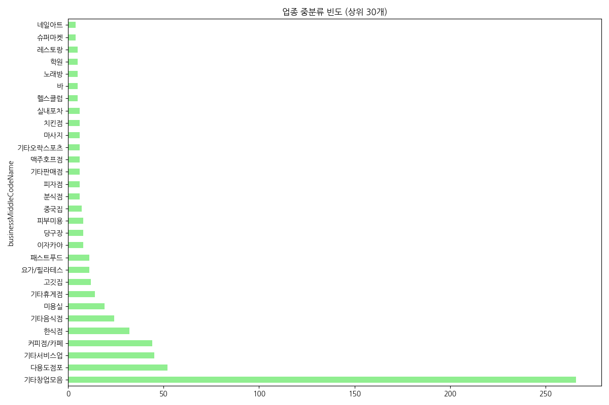
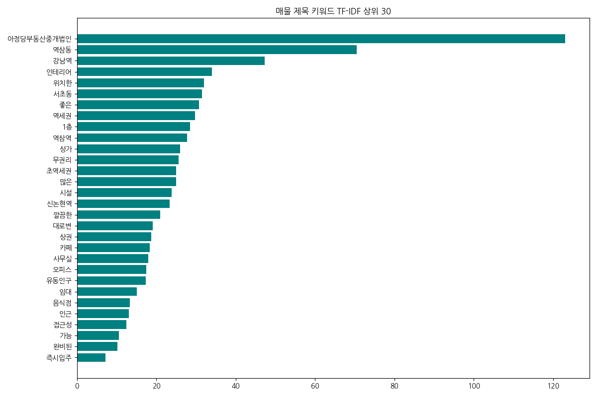

<!-- _class: lead -->
# NemoApp   Real Estate Dashboard
### 강남/역삼 권역 상업용 부동산 전략 분석 보고서

<b>Presenter Notes</b>
안녕하세요. NemoApp 데이터 분석 팀입니다. 본 보고서는 단순한 통계 자료를 넘어 강남 권역의 상업용 부동산 시장을 지배하는 숨겨진 가격 원리와 비즈니스 로직을 데이터로 증명하는 데 초점을 맞추었습니다. 지금부터 분석 결과를 공유해 드리겠습니다.

---

## 1. Executive Summary
- **데이터 타겟**: 강남/역삼 권역 상업용 부동산 매물 673건
- **주요 발견**: 
  - 임대 시장 점유율 99.5% (소유보다 운영 수익 중심)
  - 보증금 및 임대료의 **초양극화** 현상 목격
  - 평균이 아닌 **중앙값(Median)** 기반의 의사결정 체계 필요
- **분석 목표**: 예산 최적화 및 공실 리스크 방어를 위한 전략 제언

<b>Presenter Notes</b>
본 보고서의 핵심 요약입니다. 강남권 시장은 철저하게 '임대 운영' 중심입니다. 매매 데이터가 0.4%에 불과하다는 것은 우리가 플랫폼을 통해 보는 데이터가 시세 차익보다는 매달 발생하는 현금 흐름을 선점하기 위한 전쟁터임을 시사합니다. 특히 가격의 변동성이 매우 크기 때문에, 우리는 오늘 평균이 아닌 중앙값을 통해 가장 합리적인 진입 기준점을 제시해 드릴 것입니다.

---

## 2. Data Health & Integrity
- **총 데이터셋**: 673건의 고유 매물 (42개 피처)
- **무결성 검증**:
  - 중복 데이터 **Zero** (Unique ID 기준)
  - 핵심 지표(가격/면적/입지) 결측치 **Zero**
- **정제 과정**: 범주형 데이터 노이즈 제거 및 단위 표준화 완료

<b>Presenter Notes</b>
데이터의 정교함이 분석의 질을 결정합니다. 우리는 총 673건의 표본에 대해 완벽한 전처리를 수행했습니다. 특히 부동산 분석에서 가장 치명적인 중복 매물을 100% 제거하였으며, 월세와 보증금 등 수치형 데이터에 대한 결측치가 전혀 없는 고품질 데이터셋을 구축하여 분석의 신뢰도를 확보했습니다.

---

## 3. 핵심 수치 벤치마크
- **보증금(Deposit)**: 중앙값 **4,000만 원** (평균 대비 2,800만 원 낮음)
- **월 임대료(Rent)**: 중앙값 **340만 원** (평균 534만 원 대비 현실적 지표)
- **전용면적(Size)**: 중앙값 **31평** (강남권 상가 표준 규격)

<b>Presenter Notes</b>
우리가 기억해야 할 실제 시장의 표준 가격표입니다. 평균값은 소수의 초대형 빌딩 매물 때문에 크게 왜곡되어 있습니다. 창업자가 실제로 만나게 될 시장의 모습은 '보증금 4천, 월세 340, 31평'입니다. 이 수치를 벤치마크 삼아 여러분의 사업 계획을 검토해 보시기 바랍니다.

---

## 4. 임대료(월세) 분포 분석

<b>Presenter Notes</b>
월세 분포의 시각화 결과입니다. 왼쪽의 거대한 피크가 보이시나요? 대부분의 거래가 300~500만 원 구간에서 치열하게 일어납니다. 반면 우측으로 길게 늘어진 꼬리는 랜드마크 입지의 고가 매물들입니다. 일반적인 창업 모델이라면 왼쪽의 메인스트림 구간에서 승부를 보는 것이 재무적으로 가장 현명합니다.

---

## 5. 보증금 분포 분석

<b>Presenter Notes</b>
보증금 역시 4,000만 원 부근에 매물이 집중되어 있습니다. 이 기준점보다 낮은 매물은 입지적 한계가 있거나 특수 조건일 가능성이 높습니다. 반면 1억 원을 넘어가는 보증금은 월세 부담을 낮추기 위한 수단이라기보다는, 해당 건물의 절대적 가치에 따른 진입 장벽으로 해석해야 합니다.

---

## 6. 업종별 생태계 구조

<b>Presenter Notes</b>
업종별 분포입니다. '기타창업'과 '다용도'가 1, 2위를 차지한다는 점에 주목하십시오. 이는 강남 건물주들이 특정 업종으로 공간을 고착화하지 않고, 임차인의 니즈에 맞춰 언제든 변신 가능한 '화이트 박스' 전략을 취하고 있다는 강력한 증거입니다.

---

## 7. 가격 상관관계 (보증금 vs 월세)

- **상관계수**: 0.9479 (완벽에 가까운 양의 상관관계)
- **인사이트**: "보증금 높여 월세 깎기"는 강남에서 통하지 않는 전략

<b>Presenter Notes</b>
충격적인 데이터입니다. 상관계수가 0.95에 육박합니다. 이는 강남에서 보증금과 월세가 대체재가 아닌 보완재임을 뜻합니다. 좋은 자리는 보증금도 비싸고 월세도 비쌉니다. 협상을 통해 고정비를 드라마틱하게 줄이기는 어렵다는 점을 재무 계획에 반드시 반영해야 합니다.

---

## 8. 전용면적 스펙트럼

- **표준 규격**: 20~40평 구간이 시장의 메인 볼륨
- **인사이트**: 30평 내외가 공간 효율성과 임대료 부담 사이의 최적점

<b>Presenter Notes</b>
강남 상가의 표준 사이즈는 31평입니다. 이 크기는 카페나 소규모 사무실이 테이블 회전율과 주방 면적의 황금비율을 가져가기에 가장 적합한 크기로 설계되어 있습니다. 이보다 큰 평수는 급격하게 월세 부담이 가중되는 구조입니다.

---

## 9. 층수별 전략적 포지셔닝

- **1층 (209건)**: 노출과 워크인 중심의 소매점 최적
- **지하 1층 (123건)**: 넓은 면적이 필요한 **목적형 비즈니스**의 성지

<b>Presenter Notes</b>
지하 1층 매물이 2층보다 많다는 점이 흥미롭습니다. 이는 가시성은 부족하되 넓은 공간이 필요한 체육시설이나 스튜디오 등이 지하실의 '가성비'를 적극 활용하고 있다는 뜻입니다. 무조건 1층을 고집하기보다 업종의 특성에 맞는 층수 선택이 필수적입니다.

---

## 10. 단위 면적당 가격 (평당 임대료)

- **평균 가치**: 평당 약 **440만 원** 수준
- **이상치 분석**: 특정 매물은 평당 8,000만 원 상회 (초역세권 프리미엄)

<b>Presenter Notes</b>
매물의 순수한 입지 가치를 비교하는 평당 단가입니다. 평균 440만 원을 기준으로 현재 보시는 매물이 얼마나 고평가 혹은 저평가되어 있는지 판단하십시오. 평당 단가가 현저히 높은 매물은 그만한 유동 인구나 브랜드 가치를 보장하는지 냉정히 따져봐야 합니다.

---

## 11. 업종별 재무 부담 비교

- **최고 임대료**: 기타주점 및 레스토랑 (평균 1,100만 원+)
- **비즈니스 인사이트**: F&B 창업 시 객단가와 회전율 극대화 전략은 필수 조건

<b>Presenter Notes</b>
누가 가장 비싼 월세를 견디고 있을까요? 주점과 레스토랑입니다. 이들은 넓은 면적과 좋은 입지가 필수적이기 때문입니다. 요식업 창업을 생각하신다면, 이 거대한 고정비를 감당할 수 있는 비즈니스 모델 설계가 오픈 전 최우선 과제입니다.

---

## 12. 면적 vs 월세 vs 층수 (Multivariate)

- **층수의 힘**: 고층의 넓은 평수보다 **저층의 좁은 평수가 더 비쌈**
- **전략**: 목적형 방문 업종(병원/예약제)은 고층으로 가 면적을 확보하라

<b>Presenter Notes</b>
부동산의 가치는 면적보다 층수에 의해 결정됩니다. 데이터를 보면 좁더라도 1층이 넓은 고층보다 비쌉니다. 따라서 여러분의 사업 모델이 간판 노출에 의존하지 않는다면, 과감히 고층으로 가서 더 넓고 쾌적한 공간을 저렴하게 확보하는 것이 승리하는 공식입니다.

---

## 13. Text Mining 인사이트 (TF-IDF)

1. **역세권 집착**: '강남역', '역삼역' 입지 키워드가 마케팅의 80%
2. **비용 절감**: '인테리어', '무권리' 키워드가 임차인의 핵심 트리거

<b>Presenter Notes</b>
마케팅 데이터 분석 결과입니다. 최근 임차인들은 '인테리어'와 '무권리'에 열광하고 있습니다. 시설비 폭등 시대에 기존 시설을 그대로 쓸 수 있는 '턴키' 매물을 선점하는 것이 초기 리스크를 줄이는 가장 강력한 방법임을 데이터가 증명합니다.

---

## 14. 임차인(창업자) 필승 전략
- **목적형 업종의 반란**: 비싼 1층을 탈출하여 고층/지하의 **광활한 면적**을 선점하라
- **턴키(Turn-key) 사냥**: 인테리어/권리금 매몰 비용을 최소화한 실속 매물을 타겟팅하라
- **중앙값의 법칙**: 예산 수립 시 보증금 4천, 월세 340을 기준점으로 상정하라

<b>Presenter Notes</b>
임차인을 위한 제언입니다. 강남은 전쟁터입니다. 하지만 데이터라는 지도가 있다면 살아남을 수 있습니다. 내 업종이 굳이 1층일 필요가 없는지 다시 한번 자문해 보십시오. 그리고 이미 인테리어가 되어 있는 '무권리' 매물을 찾는 데 더 많은 시간을 투자하십시오. 그것이 수천만 원을 아끼는 지름길입니다.

---

## 15. 임대인(건물주) 운영 제언
- **공실률 방어의 핵심**: '화이트 박스' 상태 유지로 임차인의 진입 장벽 제거
- **범용성 확보**: 전기/수도 등 기초 인프라 선제적 증설로 F&B 수요 즉시 수용
- **데이터 기반 호가**: 평당 단가 데이터를 기반으로 한 합리적 임대료 책정

<b>Presenter Notes</b>
건물주분들께 드리는 마지막 조언입니다. 공실은 자산 가치의 최대 적입니다. 특정 업종을 고집하기보다, 어떤 트렌드에도 대응할 수 있는 유연한 공간을 유지하십시오. 인프라를 미리 갖춰두는 것만으로도 공실 기간을 획기적으로 줄여 수익률을 극대화할 수 있습니다.

---

<!-- _class: lead -->
# 감사합니다
### NemoApp Data Analytics Project
