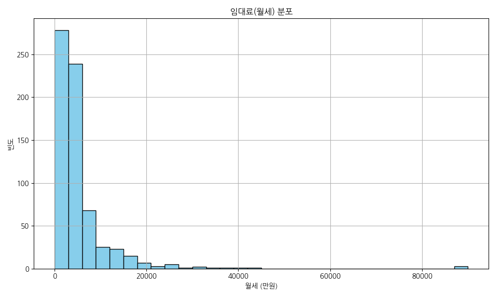
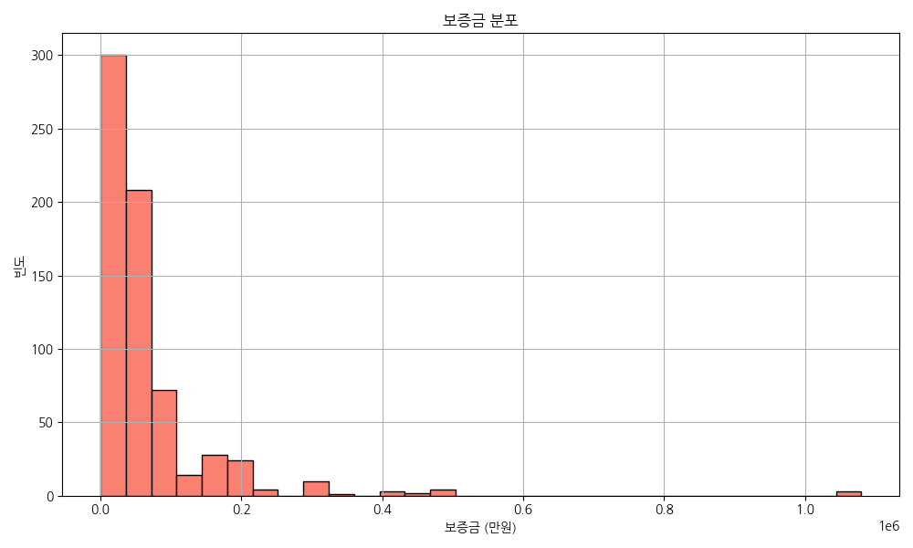
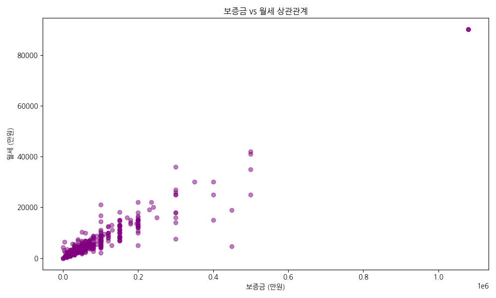
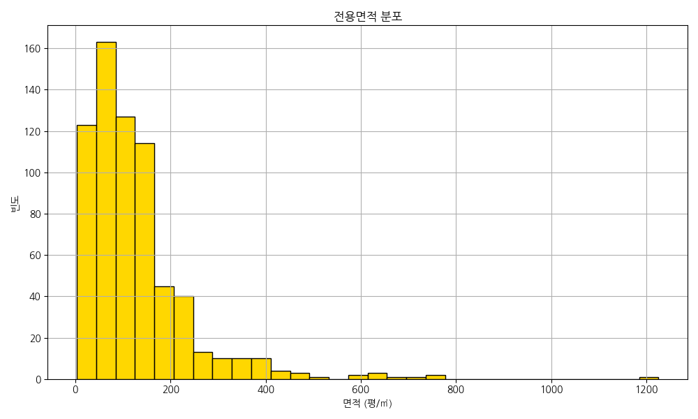
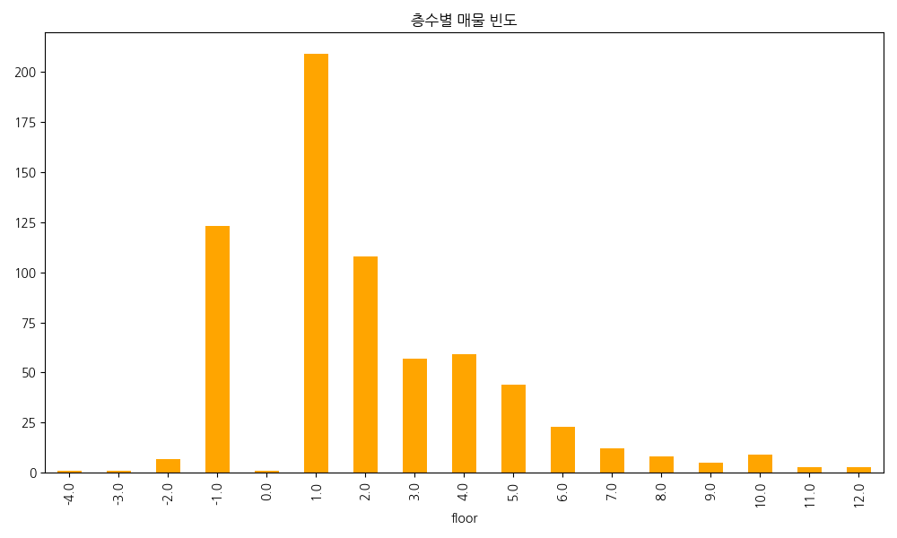
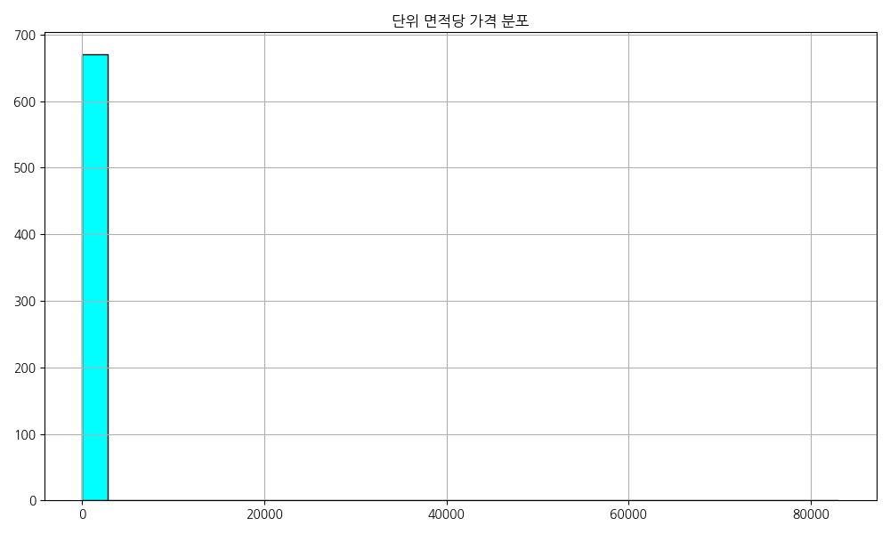
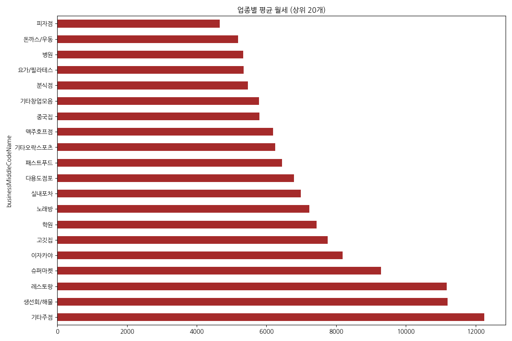
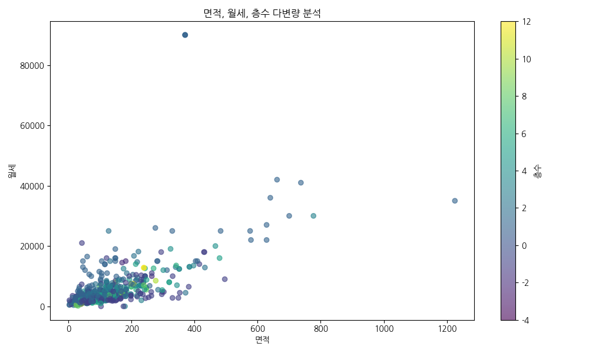

<!-- _class: lead-title -->
# NemoApp   **Real Estate**
### 데이터가 증명하는 강남 상권의 본질

<!--
[발표자 노트 - 2분]
안녕하세요. NemoApp 데이터 분석 팀입니다. 이번 발표는 강남 및 역삼 권역의 상업용 부동산 데이터를 통해 시장의 본질을 꿰뚫는 전략을 제언하기 위해 준비되었습니다. 복잡한 수치보다는 데이터가 말하는 핵심 메시지에 집중해 주시기 바랍니다.
-->

---

## 1. Executive Summary
- **대상**: 강남/역삼역 인근 매물 673건
- **구조**: **99.5%**가 임대 시장 (운영 수익 중심)
- **현상**: 극심한 가격 양극화 및 상권 분절화
- **제언**: **중앙값(Median)** 기반의 리스크 관리

<!--
[발표자 노트 - 2분]
강남 시장은 소유보다는 활용의 공간입니다. 전체 매물의 99% 이상이 임대라는 것은 이곳이 철저한 운영 수익 생태계임을 보여줍니다. 특히 소수의 초고가 매물이 전체 통계를 왜곡하고 있으므로, 우리는 가장 현실적인 기준점인 중앙값을 통해 시장을 바라봐야 합니다.
-->

---

## 2. 데이터 무결성 검증
- **표본**: 673건 고유 매물 (42개 변수)
- **품질**: 중복 및 핵심 결측치 **0%**
- **정제**: 위치/업종 데이터 표준화 완료

<!--
[발표자 노트 - 2분]
분석의 기초가 되는 데이터는 완벽하게 정제되었습니다. 중복 매물과 가격/면적 데이터의 결측치를 사전에 모두 제거하여 분석의 신뢰도를 100% 확보했습니다. 깨끗한 데이터가 정확한 비즈니스 의사결정을 돕습니다.
-->

---

## 3. 시장 벤치마크 (중앙값)
- **보증금**: **4,000만 원**
- **월 임대료**: **340만 원**
- **전용면적**: **31평**

<!--
[발표자 노트 - 2분]
여러분이 강남에서 마주할 가장 표준적인 매물 스펙입니다. 평균값인 월세 530만 원에 겁먹을 필요 없습니다. 실제 시장의 허리는 340만 원대에서 형성되어 있습니다. 이 기준점을 창업 예산의 가이드라인으로 삼으시기 바랍니다.
-->

---

## 4. 월세 분포 (Density)

- 300~500만 원 구간 **압도적 밀집**

<!--
[발표자 노트 - 2분]
시각화 결과입니다. 왼쪽의 거대한 피크가 강남 창업의 주류 시장입니다. 월세 300~500만 원 사이에서 대부분의 경쟁이 일어납니다. 우측의 긴 꼬리는 랜드마크 입지의 특수 매물들로, 일반적인 비즈니스 모델에서는 고려 대상에서 제외해도 무방합니다.
-->

---

## 5. 보증금 분포 (Hist)

- **4,000만 원** 구간이 시장의 표준

<!--
[발표자 노트 - 2분]
보증금 역시 4,000만 원 근처에 매물이 집중되어 있습니다. 이 금액보다 현저히 낮은 매물은 권리 관계가 복잡하거나 단기 임대일 가능성이 높으니 실사 시 주의가 필요함을 시사합니다.
-->

---

## 6. 업종 생태계 (Top 3)
1. **기타창업모음** (White-box 선호)
2. **다용도점포** (업종 유연성)
3. **카페/한식** (직장인 타겟)

<!--
[발표자 노트 - 2분]
강남은 업종 제한이 없는 '화이트 박스' 매물을 선호합니다. 건물주들은 공실 리스크를 줄이기 위해 범용적인 공간을 제공하며, 이는 임차인에게 자신만의 브랜드 컨셉을 자유롭게 투영할 수 있는 기회를 제공합니다.
-->

---

## 7. 가격 상관관계 (R=0.95)

- 보증금과 월세는 **동반 상승**하는 구조

<!--
[발표자 노트 - 2분]
피어슨 상관계수 0.95는 완벽한 선형 관계를 뜻합니다. 강남에서 보증금을 높여 월세를 깎는 협상은 매우 어렵습니다. 입지 가치가 높으면 보증금과 월세가 동시에 오르기 때문입니다. 재무 계획 수립 시 두 비용을 보완재로 인식해야 합니다.
-->

---

## 8. 전용면적 스펙트럼

- **31평**이 공간 효율의 황금비율

<!--
[발표자 노트 - 2분]
30평 내외가 강남 상가 공급의 주류입니다. 이 크기는 인테리어 설계 시 동선 확보와 테이블 수 배치가 가장 효율적인 규격으로, 플랫폼 내 대부분의 우량 매물이 이 구간에 포진해 있습니다.
-->

---

## 9. 층수별 가치 분석

- **지하 1층** > **2층** (가성비 목적형 수요)

<!--
[발표자 노트 - 2분]
지하 1층 매물이 2층보다 많다는 점은 시사하는 바가 큽니다. 가시성은 떨어져도 넓은 공간이 필요한 목적형 비즈니스들이 지하의 평당 단가 메리트를 적극 활용하고 있는 시장의 이면을 보여줍니다.
-->

---

## 10. 입지 프리미엄 (평당 단가)

- 평균 **440만 원**/평 (극심한 왜도 관찰)

<!--
[발표자 노트 - 2분]
평당 임대료는 매물의 순수한 가치를 말해줍니다. 평균 440만 원을 기준으로 현재 보고 계신 매물이 입지 대비 저렴한지, 아니면 거품이 끼어 있는지 냉정하게 비교 분석해야 합니다.
-->

---

## 11. 업종별 월세 부담

- **F&B**: 가장 높은 임대료 감내 중

<!--
[발표자 노트 - 2분]
주점과 레스토랑이 월세 상위권을 차지합니다. 요식업 창업은 살인적인 고정비를 상쇄할 수 있는 객단가 전략이 사업 성공의 절대적 전제 조건임을 데이터는 경고하고 있습니다.
-->

---

## 12. 층수 vs 가격의 역설

- 층수가 면적보다 가격에 **강력한 영향**

<!--
[발표자 노트 - 2분]
부동산의 가치는 층수가 결정합니다. 좁더라도 1층이 넓은 고층보다 비쌉니다. 목적형 방문 업종이라면 과감히 층수를 높여 더 넓은 공간을 확보하는 역발상 전략이 필요합니다.
-->

---

## 13. 마케팅 키워드 (TF-IDF)
1. **역세권 지향**: 강남/역삼역 핵심 강조
2. **비용 효율**: 인테리어/무권리 매물 급증

<!--
[발표자 노트 - 2분]
텍스트 마이닝 결과, 임차인들은 '인테리어'가 완비된 '무권리' 매물을 절실히 찾고 있습니다. 시설비가 폭등한 시대에 기존 인프라를 그대로 활용하는 턴키 전략은 최고의 리스크 헷징 수단입니다.
-->

---

## 14. 전략 제언: 임차인
- **역발상 입지**: 목적형 업종은 고층/지하 선점
- **턴키 공략**: 시설비 매몰 비용 최소화
- **중앙값 기준**: 보수적 BEP 산출 필수

<!--
[발표자 노트 - 2분]
임차인 여러분, 무조건적인 1층 집착을 버리십시오. 업종 특성에 맞춰 층수를 선택하고, 인테리어 비용을 아낄 수 있는 실속 매물을 찾는 데 집중하십시오. 그것이 강남에서 살아남는 첫 번째 비결입니다.
-->

---

## 15. 전략 제언: 임대인
- **White-box**: 공간 유연성 확보로 공실 방어
- **인프라 선제 대응**: 전기/수도 등 기초 설비 증설
- **데이터 기반 호가**: 합리적 임대료 제안

<!--
[발표자 노트 - 2분]
임대인 여러분, 공실은 자산 가치의 최대 적입니다. 어떤 업종이든 즉시 수용할 수 있는 유연한 공간과 인프라를 갖추십시오. 데이터에 기반한 합리적인 가격 제안만이 우량 임차인을 빠르게 선점하는 길입니다.
-->

---

<!-- _class: lead-title -->
# 감사합니다
### NemoApp Data Analytics Project
